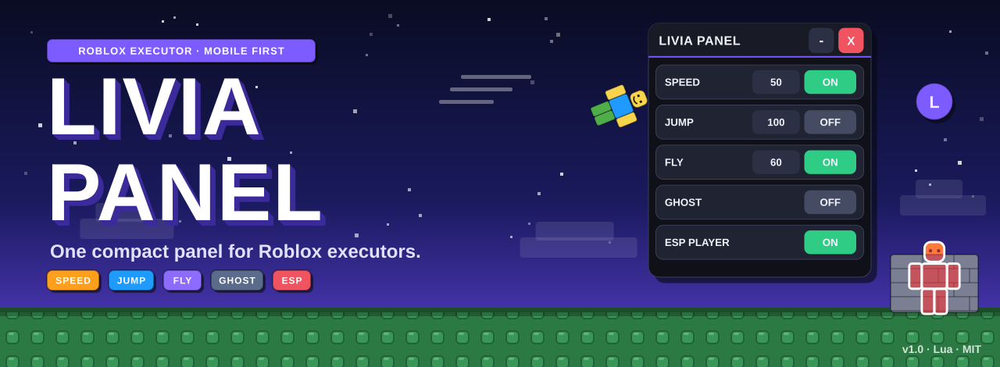
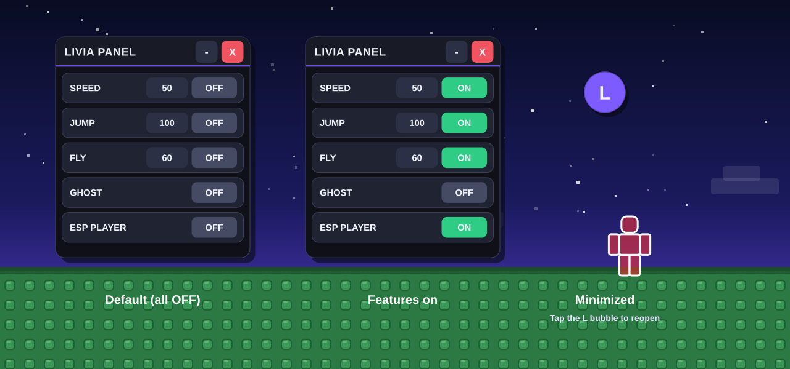
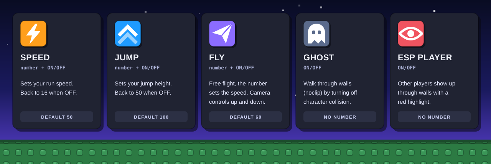
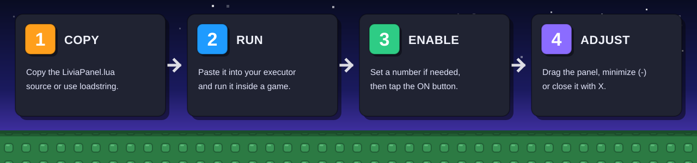
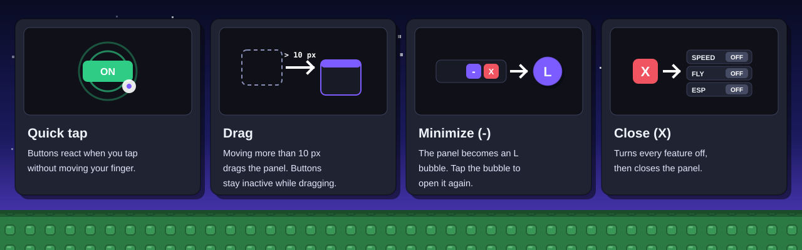
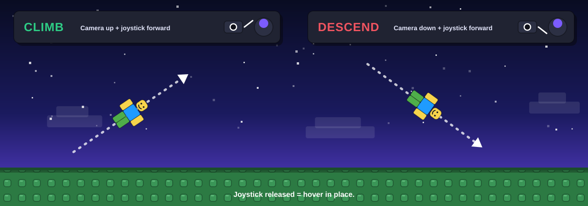
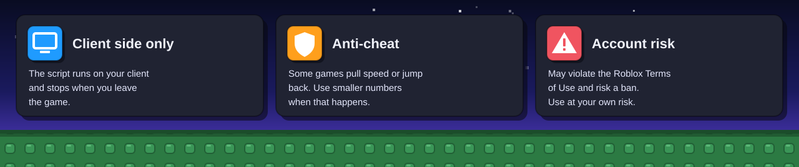

<div align="center">



<a href="https://github.com/akndrn000/LiviaPanel.lua/blob/main/LiviaPanel.lua"></a>


[Bahasa Indonesia](README.md) · [English](README.en.md)

**One compact panel for Roblox executors.** Speed, Jump, Fly, Ghost, and ESP Player in a single Lua script that fits on a phone screen.

[Try it now](#how-to-use) · [Features](#features) · [Controls](#controls) · [Default values](#default-values) · [Safety](#safety-and-risk) · [Customization](#customization) · [Contributing](#contributing)

</div>

---

## Overview

Many executor scripts fill the screen with a large menu that is hard to tap on a phone. Livia Panel uses one small 300 x 342 px window with five rows of buttons. You can drag it anywhere and shrink it to a bubble.

Three ideas guide the script:

- **One file, no dependencies.** All the code lives in `LiviaPanel.lua` (about 350 lines). No libraries, no extra files.
- **Built for touch.** The panel tells a tap from a drag, so a finger that moves the panel never presses a button by accident.
- **Clean shutdown.** The `X` button turns every feature off, disconnects every listener, and removes the panel. Running the script twice never leaves a duplicate panel.

## Preview

<div align="center">



</div>

The image is a vector illustration that copies the colors, size, and layout of the real panel. The values shown match the script's defaults.

## Features

<div align="center">



</div>

| Feature         | Setting         | Description                                                                          |
| --------------- | --------------- | ------------------------------------------------------------------------------------ |
| **Speed**       | number + ON/OFF | Run speed. Goes back to 16 when switched off.                                        |
| **Jump**        | number + ON/OFF | Jump height. Goes back to 50 when switched off.                                      |
| **Fly**         | number + ON/OFF | Free flight. The number sets the speed.                                              |
| **Ghost**       | ON/OFF          | Walk through walls (noclip) by turning off character collision.                      |
| **ESP Player**  | ON/OFF          | Other players show through walls with a red highlight and a white outline.           |
| **Drag**        | touch + move    | Move the panel from the header, the background, or any row.                          |
| **Minimize**    | `-` button      | The panel shrinks to an **L** bubble you can move, then tap to reopen.               |
| **Live numbers**| number box      | Change a number while a feature is ON and the new value applies right away.         |
| **Persistent**  | automatic       | Features stay on after your character respawns.                                      |

## How to use

<div align="center">



</div>

1. **Copy** the contents of [`LiviaPanel.lua`](LiviaPanel.lua), or prepare the `loadstring` line below.
2. **Paste** it into your executor and **run** it inside a Roblox game.
3. **Enable** a feature by tapping its `OFF` button until it reads `ON`. Type a number in the box if you want a different value.
4. **Adjust** the panel: drag it somewhere comfortable, shrink it with `-`, or close it with `X`.

With `loadstring`:

```lua
loadstring(game:HttpGet("https://raw.githubusercontent.com/akndrn000/LiviaPanel.lua/main/LiviaPanel.lua"))()
```

> [!TIP]
> Start with small numbers, for example Speed 30 or Jump 70. Raise them slowly until the game starts pulling your character back, then drop the value a little.

## Controls

<div align="center">



</div>

| Action               | Result                                                                                       |
| -------------------- | -------------------------------------------------------------------------------------------- |
| Tap a button         | Switches `OFF` to `ON`, or the reverse.                                                      |
| Drag more than 10 px | Moves the panel. Buttons stay inactive while your finger moves and react only to a quick tap. |
| `-`                  | Shrinks the panel to the **L** bubble. Tap the bubble to open it again.                      |
| `X`                  | Turns off every active feature, disconnects listeners, and closes the panel.                 |
| Edit a number box    | The new value applies immediately if the feature is ON. Negative numbers and text are rejected. |

### Steering altitude while flying

<div align="center">



</div>

The joystick sets direction and speed. Camera tilt sets climb or descent: aim the camera up while pushing the joystick forward to climb, aim it down to descend. Release the joystick and your character hovers in place.

## Default values

| Feature | Default value | When switched off                          |
| ------- | ------------- | ------------------------------------------ |
| Speed   | `50`          | `WalkSpeed` returns to `16`                |
| Jump    | `100`         | `JumpPower` returns to `50`                |
| Fly     | `60`          | The flight force is released               |
| Ghost   | no number     | `HumanoidRootPart` collision is restored   |
| ESP     | no number     | All highlights are removed                 |

> [!NOTE]
> The restore values `16` and `50` are hardcoded in the script. A game that uses custom `WalkSpeed` or `JumpPower` ends up at 16 and 50 after you switch the feature off. Once the feature is OFF, a respawn also brings back the game's own values.

## How it works

| Feature | Mechanism                                                                                                                                                      |
| ------- | -------------------------------------------------------------------------------------------------------------------------------------------------------------- |
| Speed   | Every frame (`Heartbeat`), the script writes the number in the box to `Humanoid.WalkSpeed`.                                                                    |
| Jump    | Every frame, the script enables `UseJumpPower` and writes `JumpPower`.                                                                                         |
| Fly     | A `BodyVelocity` and a `BodyGyro` attach to `HumanoidRootPart` with `PlatformStand` on. Direction comes from `MoveDirection`, altitude from camera tilt.       |
| Ghost   | On every physics step (`Stepped`), every `BasePart` in the character gets `CanCollide = false`.                                                                |
| ESP     | One `Highlight` per player: red fill (0.5 transparency), white outline, `AlwaysOnTop`. Highlights are removed when a player leaves or ESP is switched off.     |

Because the values are reapplied every frame, features keep working after a respawn without being switched on again.

## Safety and risk

<div align="center">



</div>

- The script runs on the **client side**. The game server is not changed.
- Some games have **anti-cheat**. If speed or jump gets pulled back, use smaller numbers.
- Running scripts in a game **can violate the Roblox Terms of Use** and put your account at risk of penalties. Use it at your own risk.
- The script draws its panel in `CoreGui`, so your executor must allow access to it.
- Install the script only from this repository. Read the code first if you copied it from somewhere else.

## Known limitations

- **Local player only.** Features affect your own character. ESP only highlights other players.
- **Values are not saved.** After you leave the game or close the panel, numbers return to their defaults.
- **One panel at a time.** Running the script again closes the old panel through `_G.LiviaCleanup`, then builds a new one.
- **Ghost and respawn.** If your character still feels non-solid after you switch Ghost off, respawn to restore full collision.
- **ESP has a Roblox-side cap.** Roblox limits how many `Highlight` objects render at once, so on a full server some players may not be highlighted.
- **Tested on Delta.** The script targets phone screens and the concept was tested on Delta. Other executors may work, but nobody has verified them.

## Customization

Every setting sits near the top of `LiviaPanel.lua`.

| To change                | Edit                                                                                              |
| ------------------------ | ------------------------------------------------------------------------------------------------- |
| Default numbers          | The `V` table (`Speed = 50`, `Jump = 100`, `Fly = 60`).                                           |
| Panel colors             | The `T` table (`Accent`, `On`, `Off`, `Red`, and so on).                                          |
| Drag sensitivity         | The `DRAG_THRESHOLD` constant (default `10` pixels).                                              |
| Panel size and position  | `Main.Size` and `Main.Position`. Each extra row needs 54 px of height (46 for the row, 8 gap).    |
| Restore values           | The `applyChange` function (`16` for Speed, `50` for Jump).                                       |
| Adding a feature         | Add a key to `S` and `V`, its logic in `Heartbeat`, its cleanup in `applyChange`, then `createRow`. |

## Repository structure

```
LiviaPanel.lua          The whole script: state, feature logic, tap/drag system, UI, cleanup
README.md               Documentation in Bahasa Indonesia
README.en.md            Documentation in English
LICENSE                 MIT license
docs/
  generate-images.py    Builds every README image (SVG, two languages)
  images/               banner, preview, features, workflow, controls, fly, safety, social-preview
```

`LiviaPanel.lua` has five commented sections: `STATE`, `FEATURE LOGIC`, `TAP vs DRAG SYSTEM`, `UI`, and `CLEANUP`.

### Rebuilding the images

A Python script with no required dependencies builds the README images:

```
python3 docs/generate-images.py
```

Edit the text through the `STR` dictionary inside that file. If `cairosvg` is installed (`pip install cairosvg`), the script also writes `social-preview.png`, which you can upload under **Settings > Social preview** on GitHub.

## Contributing

Feedback and fixes are welcome. Before you open a pull request, run the script in an executor and check all five features plus the `-` and `X` buttons. If your change affects how the panel looks, run `docs/generate-images.py` and include the updated images.

## License

Released under the [MIT License](LICENSE).

---

<div align="center">

Livia Panel. An independent tool for Roblox executors. Not affiliated with Roblox Corporation.
"Roblox" is a trademark of Roblox Corporation, used only to describe what the script does.

</div>
