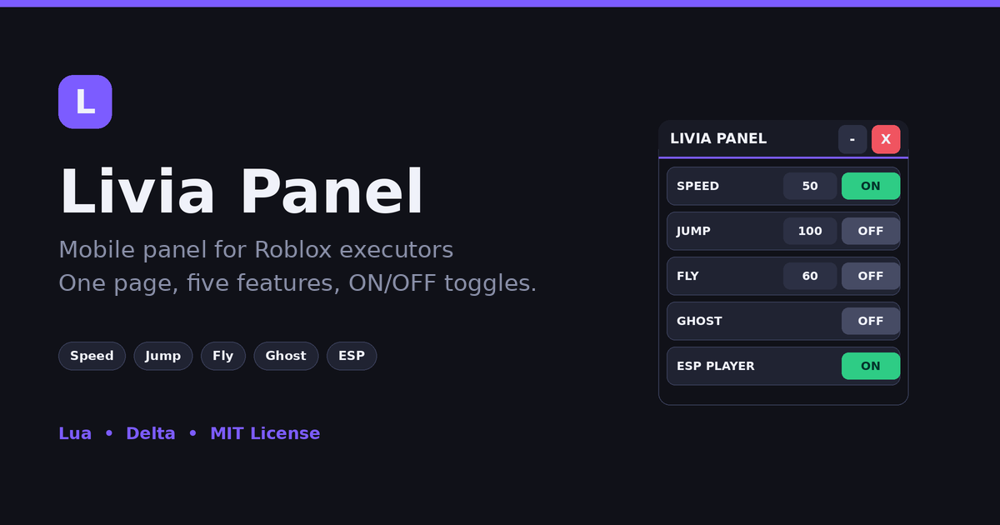
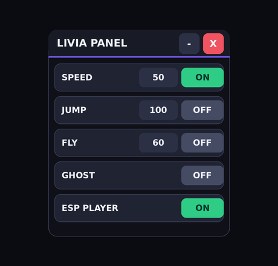

<p align="center">
  
</p>

<p align="center">
  <a href="README.md">Bahasa Indonesia</a> · <a href="README.en.md">English</a>
</p>

# Livia Panel

**A simple panel for Roblox executors, built for phone screens.** Five features in one panel: Speed, Jump, Fly, Ghost, and Player ESP. Each feature has an ON/OFF button, and values are set through number boxes. One Lua file, no dependencies.

---

## 📌 Features

| Feature | Setting | Description |
|---|---|---|
| **Speed** | number + ON/OFF | Walk speed (default 50, returns to 16 when OFF) |
| **Jump** | number + ON/OFF | Jump height (default 100, returns to 50 when OFF) |
| **Fly** | number + ON/OFF | Flight, the number is the fly speed (default 60) |
| **Ghost** | ON/OFF | Walk through walls (noclip) |
| **ESP Player** | ON/OFF | Other players are visible through walls (Highlight) |

Extras:

- **Buttons only fire on a short tap.** Dragging the panel does not toggle a button on or off.
- The panel can be dragged from the header, the background, a row, or directly from a button.
- Values in the number boxes can be changed while a feature is ON and take effect immediately.
- The `-` button shrinks the panel into a draggable **L** bubble.
- The `X` button turns off every feature and removes the panel. Running the script again does not create a duplicate panel.

## 🖼️ Preview

<p align="center">
  
</p>

The panel is 300×342, each row is 46 tall, and text is size 14, so it is comfortable to tap on a phone.

## 🚀 How to use

1. Open a Roblox game and launch your executor (for example, Delta).
2. Copy the contents of [`LiviaPanel.lua`](LiviaPanel.lua) into the executor and press **Execute**, or use loadstring:

```lua
loadstring(game:HttpGet("https://raw.githubusercontent.com/USERNAME/REPO/main/LiviaPanel.lua"))()
```

Replace `USERNAME` and `REPO` with your own account and repository name.

3. Type a number in the box, then press **ON**.
4. For **Fly**, move the joystick to go forward. Aim the camera up or down to rise or descend.

## 🎮 Controls

| Button | Function |
|---|---|
| `ON` / `OFF` | Turns the feature on that row on or off |
| Number box | Sets the value (Speed, Jump, Fly). Input that is not a number is reverted to the previous value |
| `-` | Collapses the panel into the **L** bubble |
| **L** (bubble) | Opens the panel again |
| `X` | Turns off every feature, then closes the panel |
| Drag | Moves the panel (a drag of more than 10 px counts as dragging, not tapping) |

## 📦 File structure

```
livia-panel/
├── LiviaPanel.lua       # Main script (UI + logic, single file)
├── assets/
│   ├── banner.png       # Banner above the README (1200x630, can be used as a social preview)
│   ├── en/
│   │   └── banner.png   # English banner (used by README.en.md)
│   └── preview.png      # Panel preview
├── LICENSE              # MIT
├── README.md            # Bahasa Indonesia
└── README.en.md         # English
```

`LiviaPanel.lua` is split into blocks:

```
STATE                 S (ON/OFF) and V (values) variables + the color theme T
FEATURE LOGIC         Heartbeat/Stepped for Speed, Jump, Fly, Ghost, ESP
TAP vs DRAG SYSTEM    Tells a drag from a tap (DRAG_THRESHOLD)
UI                    Header, feature rows, minimize/close buttons
CLEANUP               Turns off features, disconnects, removes the GUI
```

## 🛠️ Customization

- **Starting values:** edit the `V` table near the top, for example `local V = {Speed = 50, Jump = 100, Fly = 60}`.
- **Colors:** edit the `T` table (`Accent`, `On`, `Off`, `Red`, and so on).
- **Drag sensitivity:** change `DRAG_THRESHOLD` (default 10 px). The larger it is, the harder it is to press a button by accident when your touch slides slightly.
- **Panel size:** change `Main.Size` and the row height in `createRow`.

## ⚠️ Notes

- Some games have anti-cheat. If speed or jump feels pulled back, use a smaller number.
- The script runs on the client side only and sends no data anywhere.
- Using scripts in games can violate Roblox's Terms of Use and put your account at risk of penalties. Use at your own risk.
- "Roblox" is a trademark of Roblox Corporation, mentioned only to describe what the script is for. This project is not affiliated with Roblox.

## 📄 License

[MIT](LICENSE)
