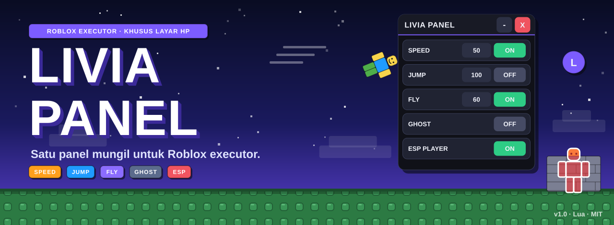
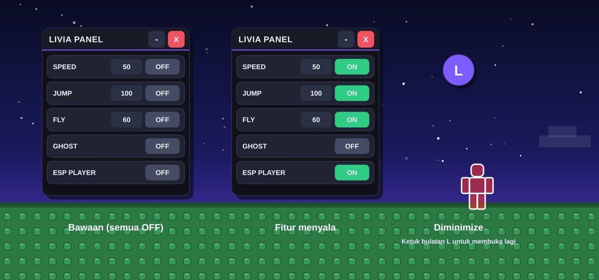
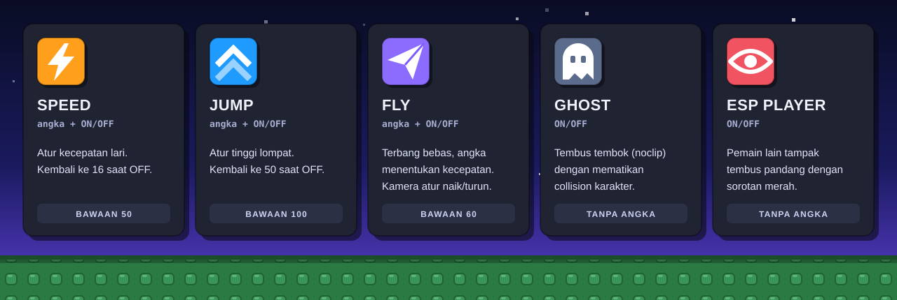
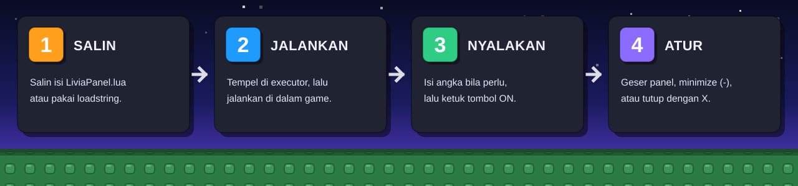
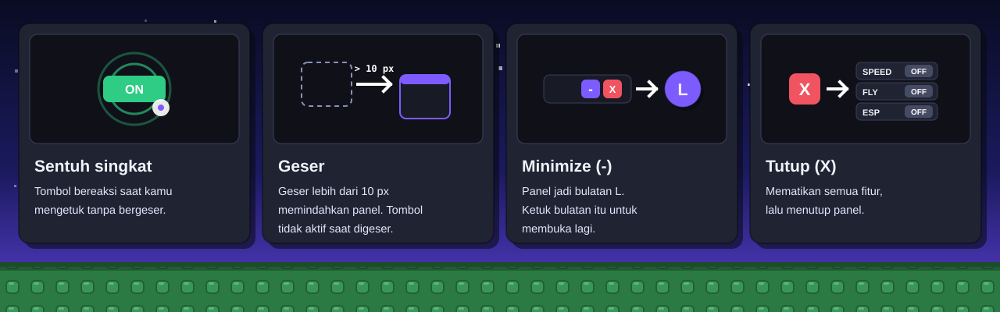
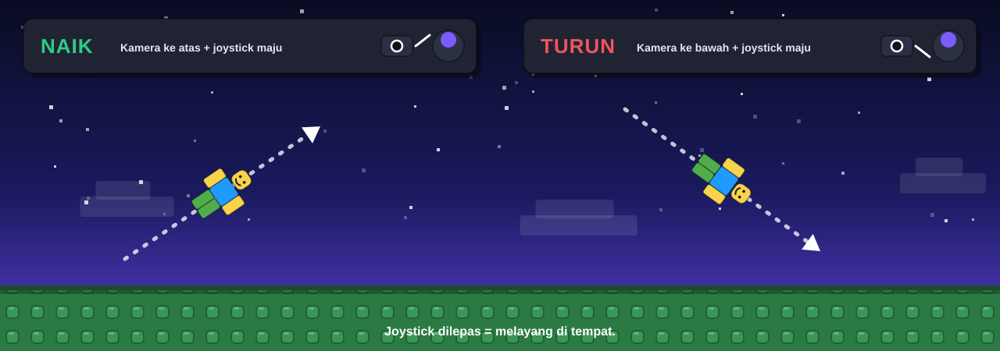
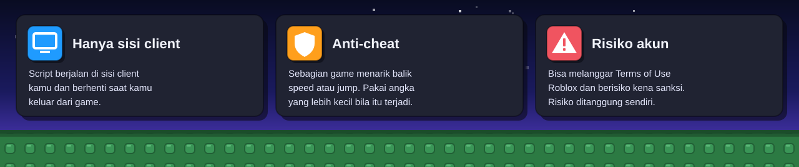

<div align="center">



<a href="https://github.com/akndrn000/LiviaPanel.lua/blob/main/LiviaPanel.lua"></a>


[Bahasa Indonesia](README.md) · [English](README.en.md)

**Satu panel mungil untuk Roblox executor.** Speed, Jump, Fly, Ghost, dan ESP Player dalam satu skrip Lua yang muat di layar HP.

[Coba sekarang](#cara-pakai) · [Fitur](#fitur) · [Kontrol](#kontrol) · [Nilai bawaan](#nilai-bawaan) · [Keamanan](#keamanan-dan-risiko) · [Kustomisasi](#kustomisasi) · [Kontribusi](#kontribusi)

</div>

---

## Ringkasan

Banyak skrip executor memenuhi layar dengan menu besar yang susah ditekan di HP. Livia Panel memakai satu jendela kecil berukuran 300 x 342 px dengan lima baris tombol, bisa digeser ke mana saja, dan bisa diciutkan jadi bulatan.

Tiga hal yang menjadi pegangan skrip ini:

- **Satu file, tanpa dependensi.** Semua kode ada di `LiviaPanel.lua` (sekitar 350 baris). Tidak ada library, tidak ada file tambahan.
- **Dirancang untuk sentuhan.** Panel membedakan ketukan dan geseran, jadi jari yang menggeser panel tidak menekan tombol secara tidak sengaja.
- **Bersih saat dimatikan.** Tombol `X` mematikan semua fitur, memutus semua koneksi, lalu menghapus panel. Menjalankan skrip dua kali tidak membuat panel ganda.

## Tampilan

<div align="center">



</div>

Gambar adalah ilustrasi vektor yang meniru warna, ukuran, dan susunan panel asli. Nilai pada gambar sama dengan nilai bawaan skrip.

## Fitur

<div align="center">



</div>

| Fitur          | Pengaturan     | Keterangan                                                                             |
| -------------- | -------------- | -------------------------------------------------------------------------------------- |
| **Speed**      | angka + ON/OFF | Kecepatan lari. Kembali ke 16 saat dimatikan.                                          |
| **Jump**       | angka + ON/OFF | Tinggi lompat. Kembali ke 50 saat dimatikan.                                           |
| **Fly**        | angka + ON/OFF | Terbang bebas. Angka menentukan kecepatan.                                             |
| **Ghost**      | ON/OFF         | Tembus tembok (noclip) dengan mematikan collision karakter.                            |
| **ESP Player** | ON/OFF         | Pemain lain tampak tembus pandang dengan sorotan merah dan garis tepi putih.           |
| **Geser**      | sentuh + tarik | Geser panel lewat header, latar, atau baris mana pun.                                  |
| **Minimize**   | tombol `-`     | Panel menciut jadi bulatan **L** yang bisa dipindah dan diketuk untuk membuka kembali. |
| **Angka live** | kotak angka    | Ubah angka saat fitur sedang ON dan nilai baru langsung berlaku.                       |
| **Bertahan**   | otomatis       | Fitur tetap menyala setelah karakter respawn.                                          |

## Cara pakai

<div align="center">



</div>

1. **Salin** isi [`LiviaPanel.lua`](LiviaPanel.lua), atau siapkan baris `loadstring` di bawah.
2. **Tempel** ke executor, lalu **jalankan** di dalam game Roblox.
3. **Nyalakan** fitur dengan mengetuk tombol `OFF` di barisnya sampai berubah menjadi `ON`. Isi angka di kotak bila ingin nilai lain.
4. **Atur** panel: geser ke posisi yang nyaman, ciutkan dengan `-`, atau tutup dengan `X`.

Lewat `loadstring`:

```lua
loadstring(game:HttpGet("https://raw.githubusercontent.com/akndrn000/LiviaPanel.lua/main/LiviaPanel.lua"))()
```

> [!TIP]
> Mulai dengan angka kecil, misalnya Speed 30 atau Jump 70. Naikkan pelan-pelan sampai game mulai menarik karaktermu kembali, lalu turunkan sedikit.

## Kontrol

<div align="center">



</div>

| Aksi                | Hasil                                                                                         |
| ------------------- | --------------------------------------------------------------------------------------------- |
| Ketuk tombol        | Mengubah `OFF` menjadi `ON`, atau sebaliknya.                                                 |
| Geser lebih dari 10 px | Memindahkan panel. Tombol tidak aktif selama jari bergeser, hanya saat kamu mengetuk singkat. |
| `-`                 | Menciutkan panel jadi bulatan **L**. Ketuk bulatan itu untuk membuka lagi.                    |
| `X`                 | Mematikan semua fitur yang menyala, memutus koneksi, dan menutup panel.                       |
| Ubah kotak angka    | Nilai baru berlaku saat itu juga bila fiturnya sedang ON. Angka negatif atau teks ditolak.    |

### Mengatur ketinggian saat Fly

<div align="center">



</div>

Joystick menentukan arah dan kecepatan gerak. Kemiringan kamera menentukan naik atau turun: arahkan kamera ke atas sambil mendorong joystick maju untuk naik, arahkan ke bawah untuk turun. Lepas joystick dan karakter melayang di tempat.

## Nilai bawaan

| Fitur | Nilai bawaan | Saat dimatikan                    |
| ----- | ------------ | --------------------------------- |
| Speed | `50`         | `WalkSpeed` kembali ke `16`       |
| Jump  | `100`        | `JumpPower` kembali ke `50`       |
| Fly   | `60`         | Gaya terbang dilepas              |
| Ghost | tanpa angka  | Collision `HumanoidRootPart` dipulihkan |
| ESP   | tanpa angka  | Semua sorotan dihapus             |

> [!NOTE]
> Nilai pemulihan `16` dan `50` ditulis tetap di skrip. Game yang memakai `WalkSpeed` atau `JumpPower` khusus akan kembali ke 16 dan 50 setelah kamu mematikan fiturnya. Bila fiturnya sudah OFF, respawn juga mengembalikan nilai asli game.

## Cara kerja

| Fitur | Mekanisme                                                                                                                                                    |
| ----- | ------------------------------------------------------------------------------------------------------------------------------------------------------------ |
| Speed | Setiap frame (`Heartbeat`), skrip mengisi `Humanoid.WalkSpeed` dengan angka di kotak.                                                                        |
| Jump  | Setiap frame, skrip mengaktifkan `UseJumpPower` dan mengisi `JumpPower`.                                                                                     |
| Fly   | `BodyVelocity` dan `BodyGyro` dipasang di `HumanoidRootPart` dengan `PlatformStand` aktif. Arah dari `MoveDirection`, ketinggian dari kemiringan kamera.     |
| Ghost | Setiap langkah fisika (`Stepped`), semua `BasePart` karakter diatur `CanCollide = false`.                                                                    |
| ESP   | Satu `Highlight` per pemain: isi merah (transparansi 0,5), garis tepi putih, `AlwaysOnTop`. Sorotan dihapus saat pemain keluar atau ESP dimatikan.            |

Karena nilai diterapkan ulang setiap frame, fitur tetap menyala setelah respawn tanpa perlu dinyalakan lagi.

## Keamanan dan risiko

<div align="center">



</div>

- Skrip berjalan di **sisi client**. Server game tidak ikut diubah.
- Beberapa game punya **anti-cheat**. Bila speed atau jump terasa ditarik balik, pakai angka yang lebih kecil.
- Menjalankan skrip di game **bisa melanggar Terms of Use Roblox** dan berisiko membuat akun terkena sanksi. Gunakan dengan risiko sendiri.
- Skrip memakai `CoreGui` untuk menampilkan panel, jadi executor harus menyediakan akses ke sana.
- Pasang skrip hanya dari repository ini. Periksa isinya lebih dulu bila kamu menyalinnya dari tempat lain.

## Batasan yang diketahui

- **Hanya pemain lokal.** Fitur memengaruhi karakter kamu sendiri. ESP hanya menyorot pemain lain.
- **Nilai tidak tersimpan.** Setelah keluar dari game atau menutup panel, angka kembali ke nilai bawaan.
- **Satu panel sekaligus.** Menjalankan skrip lagi menutup panel lama lewat `_G.LiviaCleanup`, lalu membuat yang baru.
- **Ghost dan respawn.** Bila karakter masih terasa tembus setelah Ghost dimatikan, respawn untuk memulihkan collision penuh.
- **ESP punya batas dari Roblox.** Roblox membatasi jumlah `Highlight` yang tampil bersamaan, jadi di server yang penuh sebagian pemain bisa tidak tersorot.
- **Diuji di Delta.** Skrip dirancang untuk layar HP dan konsepnya diuji di Delta. Executor lain mungkin bekerja, tetapi belum diverifikasi.

## Kustomisasi

Semua pengaturan ada di bagian atas `LiviaPanel.lua`.

| Ingin mengubah           | Ubah                                                                                              |
| ------------------------ | ------------------------------------------------------------------------------------------------- |
| Angka bawaan             | Tabel `V` (`Speed = 50`, `Jump = 100`, `Fly = 60`).                                               |
| Warna panel              | Tabel `T` (`Accent`, `On`, `Off`, `Red`, dan seterusnya).                                         |
| Sensitivitas geser       | Konstanta `DRAG_THRESHOLD` (bawaan `10` piksel).                                                  |
| Ukuran dan posisi panel  | `Main.Size` dan `Main.Position`. Tiap baris tambahan butuh 54 px tinggi (46 baris + 8 jarak).     |
| Nilai pemulihan          | Fungsi `applyChange` (`16` untuk Speed, `50` untuk Jump).                                         |
| Menambah fitur           | Tambah kunci di `S` dan `V`, logikanya di `Heartbeat`, pemulihannya di `applyChange`, lalu `createRow`. |

## Struktur repository

```
LiviaPanel.lua          Seluruh skrip: state, logika fitur, sistem tap/geser, UI, cleanup
README.md               Dokumentasi Bahasa Indonesia
README.en.md            Dokumentasi English
LICENSE                 Lisensi MIT
docs/
  generate-images.py    Pembuat semua gambar README (SVG, dua bahasa)
  images/               banner, preview, features, workflow, controls, fly, safety, social-preview
```

Isi `LiviaPanel.lua` terbagi dalam lima bagian bertanda komentar: `STATE`, `FEATURE LOGIC`, `TAP vs DRAG SYSTEM`, `UI`, dan `CLEANUP`.

### Membuat ulang gambar

Gambar README dibuat oleh skrip Python tanpa dependensi wajib:

```
python3 docs/generate-images.py
```

Ubah teks lewat kamus `STR` di dalam file itu. Bila `cairosvg` terpasang (`pip install cairosvg`), skrip juga membuat `social-preview.png` untuk dipasang di **Settings > Social preview** pada GitHub.

## Kontribusi

Masukan dan perbaikan sangat diterima. Sebelum membuka pull request, jalankan skrip di executor dan cek lima fitur serta tombol `-` dan `X`. Bila perubahanmu memengaruhi tampilan panel, jalankan `docs/generate-images.py` dan sertakan gambar yang diperbarui.

## Lisensi

Dirilis di bawah [Lisensi MIT](LICENSE).

---

<div align="center">

Livia Panel. Alat independen untuk Roblox executor. Tidak berafiliasi dengan Roblox Corporation.
"Roblox" adalah merek dagang Roblox Corporation, dipakai hanya untuk menjelaskan fungsi skrip.

</div>
