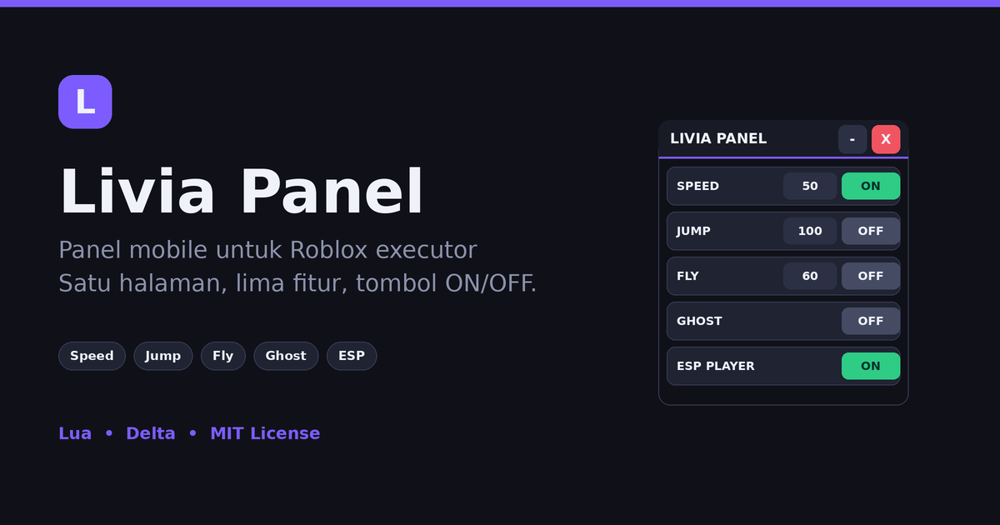

<p align="center">
  
</p>

# Livia Panel

**Panel sederhana untuk Roblox executor, dibuat untuk layar HP.** Lima fitur dalam satu panel: Speed, Jump, Fly, Ghost, dan ESP Player. Setiap fitur punya tombol ON/OFF, dan nilainya bisa diatur lewat kotak angka. Satu file Lua, tanpa dependensi.

---

## 📌 Fitur

| Fitur | Pengaturan | Keterangan |
|---|---|---|
| **Speed** | angka + ON/OFF | Kecepatan lari (bawaan 50, kembali ke 16 saat OFF) |
| **Jump** | angka + ON/OFF | Tinggi lompat (bawaan 100, kembali ke 50 saat OFF) |
| **Fly** | angka + ON/OFF | Terbang, angka = kecepatan terbang (bawaan 60) |
| **Ghost** | ON/OFF | Tembus tembok (noclip) |
| **ESP Player** | ON/OFF | Pemain lain terlihat tembus pandang (Highlight) |

Tambahan:

- **Tombol hanya aktif saat ditekan singkat.** Menggeser panel tidak ikut menyalakan atau mematikan tombol.
- Panel bisa digeser dari header, latar, baris, atau langsung dari tombol.
- Nilai di kotak angka bisa diubah saat fitur sedang ON dan langsung berlaku.
- Tombol `-` mengecilkan panel menjadi bulatan **L** yang bisa digeser.
- Tombol `X` mematikan semua fitur dan menghapus panel. Menjalankan script lagi tidak membuat panel dobel.

## 🖼️ Tampilan

<p align="center">
  
</p>

Ukuran panel 300×342, tinggi tiap baris 46, teks ukuran 14, jadi nyaman disentuh di HP.

## 🚀 Cara Pakai

1. Buka game Roblox dan jalankan executor (contoh: Delta).
2. Salin isi [`LiviaPanel.lua`](LiviaPanel.lua) ke executor lalu **Execute**, atau pakai loadstring:

```lua
loadstring(game:HttpGet("https://raw.githubusercontent.com/USERNAME/REPO/main/LiviaPanel.lua"))()
```

Ganti `USERNAME` dan `REPO` dengan akun dan nama repository kamu.

3. Isi angka di kotak, lalu tekan **ON**.
4. Untuk **Fly**, gerakkan joystick untuk maju. Arahkan kamera ke atas atau ke bawah untuk naik atau turun.

## 🎮 Kontrol

| Tombol | Fungsi |
|---|---|
| `ON` / `OFF` | Menyalakan atau mematikan fitur pada baris itu |
| Kotak angka | Mengatur nilai (Speed, Jump, Fly). Input yang bukan angka dikembalikan ke nilai sebelumnya |
| `-` | Menyembunyikan panel menjadi bulatan **L** |
| **L** (bulat) | Membuka panel kembali |
| `X` | Mematikan semua fitur lalu menutup panel |
| Geser | Memindahkan panel (geser lebih dari 10 px dianggap menggeser, bukan menekan) |

## 📦 Struktur Berkas

```
livia-panel/
├── LiviaPanel.lua       # Script utama (UI + logika, satu berkas)
├── assets/
│   ├── banner.png       # Banner di atas README (1200x630, bisa jadi social preview)
│   └── preview.png      # Tampilan panel
├── LICENSE              # MIT
└── README.md
```

Isi `LiviaPanel.lua` dibagi per blok:

```
STATE                 Variabel S (ON/OFF) dan V (nilai) + tema warna T
FEATURE LOGIC         Heartbeat/Stepped untuk Speed, Jump, Fly, Ghost, ESP
TAP vs DRAG SYSTEM    Pembeda geser dan tekan (DRAG_THRESHOLD)
UI                    Header, baris fitur, tombol minimize/close
CLEANUP               Mematikan fitur, memutus koneksi, menghapus GUI
```

## 🛠️ Kustomisasi

- **Nilai awal:** ubah tabel `V` di bagian atas, misalnya `local V = {Speed = 50, Jump = 100, Fly = 60}`.
- **Warna:** ubah tabel `T` (`Accent`, `On`, `Off`, `Red`, dan seterusnya).
- **Sensitivitas geser:** ubah `DRAG_THRESHOLD` (bawaan 10 px). Makin besar, makin sulit tombol tertekan tanpa sengaja saat menyentuh agak bergeser.
- **Ukuran panel:** ubah `Main.Size` dan tinggi baris di `createRow`.

## ⚠️ Catatan

- Beberapa game punya anti-cheat. Jika speed atau jump terasa ditarik balik, gunakan angka yang lebih kecil.
- Script hanya berjalan di sisi client dan tidak mengirim data ke mana pun.
- Menggunakan script di game bisa melanggar Terms of Use Roblox dan berisiko membuat akun terkena sanksi. Gunakan dengan risiko sendiri.
- "Roblox" adalah merek dagang Roblox Corporation, disebut hanya untuk menjelaskan kegunaan script. Proyek ini tidak berafiliasi dengan Roblox.

## 📄 Lisensi

[MIT](LICENSE)
